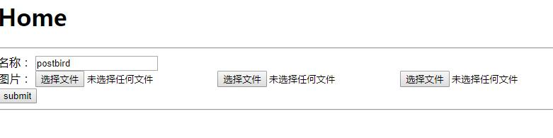

# koa-body 文件上传示例

## 一、相关文章：

- [koa-body 文件上传自定义文件夹及文件名称](http://www.ptbird.cn/koa-body-diy-upload-dir-and-filename.html)

## 二、运行说明：

### 1、克隆文件

```bash
git clone https://github.com/postbird/koa-body-demo.git
```


### 2、安装依赖

```bash
yarn install
# npm install 
```

### 3、开启 `app.js`

> 支持 `nodemon`，`nodemon app.js`

```bash
node app.js
```

### 4、访问页面：

`http://127.0.0.1:3000`

## 三、效果：

### 1、多文件上传：



- 返回结果：

```javascript
{"photo[]":[{"size":1200,"path":"E:\\Aprojects\\node_projects\\koa2\\20180619\\demo1\\public\\upload\\2018073/15306319214415395.png","name":"arrow.png","type":"image/png","mtime":"2018-07-03T15:32:01.445Z"},{"size":1200,"path":"E:\\Aprojects\\node_projects\\koa2\\20180619\\demo1\\public\\upload\\2018073/15306319214437208.png","name":"arrow.png","type":"image/png","mtime":"2018-07-03T15:32:01.463Z"},{"size":1200,"path":"E:\\Aprojects\\node_projects\\koa2\\20180619\\demo1\\public\\upload\\2018073/15306319214448102.png","name":"arrow.png","type":"image/png","mtime":"2018-07-03T15:32:01.464Z"}]}
```

### 2、单文件上传


- 返回结果：
```javascript
{"photo":{"size":1200,"path":"E:\\Aprojects\\node_projects\\koa2\\20180619\\demo1\\public\\upload\\2018073/15306325616969239.png","name":"arrow.png","type":"image/png","mtime":"2018-07-03T15:42:41.697Z"}}
```